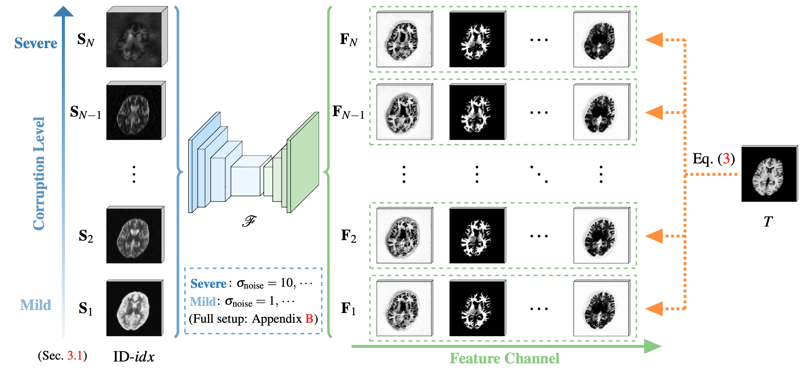

## <p align="center">[[ECCV 2024] Brain-ID: Learning Contrast-agnostic Anatomical Representations for Brain Imaging](http://arxiv.org/abs/2311.16914)</p>

**<p align="center">Peirong Liu<sup>1</sup>, Oula Puonti<sup>1</sup>, Xiaoling Hu<sup>1</sup>, Daniel C. Alexander<sup>2</sup>, Juan Eugenio Iglesias<sup>1,2,3</sup></p>**

<p align="center">
<sup>1</sup>Harvard Medical School and Massachusetts General Hospital<br />
<sup>2</sup>University College London &nbsp;&nbsp; <sup>3</sup>Massachusetts Institute of Technology
</p>

<p align="center">
  
</p>


## News

[09/02/2025] We just released a multi-modal foundation model for human brain imaging based on Brain-ID generator. Check out the preprint [here](https://arxiv.org/abs/2509.00549) and code [here](https://github.com/jhuldr/BrainFM).

[02/26/2025] Check out our latest CVPR'2025 work [here](https://github.com/peirong26/UNA) on synthesizing normal anatomy from diseased inputs via fluid-driven anomaly randomization.

[06/17/2024] Check out our recent MICCAI'2024 work [here](https://github.com/peirong26/PEPSI) on a contrastic-agnosic model for images with abnormalities with pathology-encoded modeling.


## Environment
Training and evaluation environment: Python 3.11.4, PyTorch 2.0.1, CUDA 12.2. Run the following command to install required packages.
```
conda create -n brainid python=3.11
conda activate brainid

git clone https://github.com/peirong26/Brain-ID
cd /path/to/brain-id
pip install -r requirements.txt
```


## Demo

### Playing with Brain-ID Synthetic Generator
<p align="center">
  
</p>

Please download Brain-ID pre-trained weights (brain_id_pretrained.pth), and the provided example generation images (as subfolder 'synth') in this [Google Drive folder](https://drive.google.com/drive/folders/1vuNu2dt-YdBCRW1E4gJtUsi0b_BcX6S_?usp=sharing), and move them into the './assets' folder.

```
cd /path/to/brain-id
python scripts/demo_synth.py
```
You could customize your own data generator in `cfgs/test/demo_synth.yaml`. The default output saving folder will be `outs/demo_synth`.


### Playing with Brain-ID Synthesizer and Feature Extractor

Please download Brain-ID pre-trained weights (brain_id_pretrained.pth), and test images (T1w.nii.gz, FLAIR.nii.gz) in this [Google Drive folder](https://drive.google.com/drive/folders/1vuNu2dt-YdBCRW1E4gJtUsi0b_BcX6S_?usp=sharing), and move them into the './assets' folder.

Obtain Brain-ID synthesized MP-RAGE & features using the following code:
```python3
import os, torch
from utils.demo_utils import prepare_image, get_feature
from utils.misc import viewVolume, make_dir

img_path = 'assets/T1w.nii.gz' # Try: assets/T1w.nii.gz, assets/FLAIR.nii.gz
ckp_path = 'assets/brain_id_pretrained.pth'


im, aff = prepare_image(img_path, device = 'cuda:0')
outputs = get_feature(im, ckp_path, feature_only = False, device = 'cuda:0')

# Get Brain-ID synthesized MP-RAGE
mprage = outputs['image']
print(mprage.size()) # (1, 1, h, w, d)
viewVolume(mprage, aff, names = ['out_mprage_from_%s' % os.path.basename(img_path).split('.nii.gz')[0]], save_dir = make_dir('outs'))

# Get Brain-ID features
feats = outputs['feat'][-1]
print(feats.size()) # (1, 64, h, w, d)
# Uncomment the following if you want to save the features
# NOTE: feature size could be large
#num_plot_feats = 1 # 64 features in total from the last layer
#for i in range(num_plot_feats): 
#  viewVolume(feats[:, i], aff, names = ['feat-%d' % (i+1)], save_dir = make_dir('outs/feats-%s' % os.path.basename(img_path).split('.nii.gz')[0]))
```


### Get Your Own Brain-ID 
You could also customize your own paths in `scripts/demo_brainid.py`.
```
cd /path/to/brain-id
python scripts/demo_brainid.py
```


## Training on Synthetic Data

<p align="center">
  
</p>

Use the following code to train a feature representation model on synthetic data: 
```
cd /path/to/brain-id
python scripts/train.py anat.yaml
```
We also support Slurm submission:
```
cd /path/to/brain-id
sbatch scripts/train.sh
```
You could customize your anatomy supervision by changing the configure file `cfgs/train/anat.yaml`. We provide two other anatomy supervision choices in `cfgs/train/seg.yaml` and `cfgs/train/anat_seg.yaml`.

## Evaluating on Real Data
Use the following code to fine-tune a task-specific model on real data, using Brain-ID pre-trained weights: 
```
cd /path/to/brain-id
python scripts/eval.py task_recon.yaml
```
We also support Slurm submission:
```
cd /path/to/brain-id
sbatch scripts/eval.sh
```
The argument `task_recon.yaml` configures the task (anatomy reconstruction) we are evaluating. We provide other task-specific configure files in `cfgs/train/task_seg.yaml` (brain segmentation), `cfgs/train/anat_sr.yaml` (image super-resolution), and `cfgs/train/anat_bf.yaml` (bias field estimation). You could customize your own task by creating your own `.yaml` file.

## Download 
- Brain-ID pre-trained weights and test images: [Google Drive](https://drive.google.com/drive/folders/1vuNu2dt-YdBCRW1E4gJtUsi0b_BcX6S_?usp=sharing)

- ADNI, ADNI3 and AIBL datasets: Request data from [official website](https://adni.loni.usc.edu/data-samples/access-data/).

- ADHD200 dataset: Request data from [official website](https://fcon_1000.projects.nitrc.org/indi/adhd200/).

- HCP dataset: Request data from [official website](https://www.humanconnectome.org/study/hcp-young-adult/data-releases).

- OASIS3 dataset Request data from [official website](https://www.oasis-brains.org/#data).

- Segmentation labels for data simulation: To train a Brain-ID feature representation model of your own from scratch, one needs the segmentation labels for synthetic image simulation and their corresponding MP-RAGE (T1w) images for anatomy supervision. Please refer to the pre-processing steps in `preprocess/generation_labels.py`.

For obtaining the anatomy generation labels, we rely on [FreeSurfer](https://surfer.nmr.mgh.harvard.edu/). Please install FreeSurfer first and activate the environment before running `preprocess/generation_labels.py`.


## Datasets
After downloading the datasets needed, structure the data as follows, and set up your dataset paths in `BrainID/datasets/__init__.py`.
```
/path/to/dataset/
  T1/
    subject_name.nii
    ...
  T2/
    subject_name.nii
    ...
  FLAIR/
    subject_name.nii
    ...
  CT/
    subject_name.nii
    ...
  or_any_other_modality_you_have/
    subject_name.nii
    ...
    
  label_maps_segmentation/
    subject_name.nii
    ...
  label_maps_generation/
    subject_name.nii
    ...
```

## Citation
```bibtex
@InProceedings{Liu_2023_BrainID,
    author    = {Liu, Peirong and Puonti, Oula and Hu, Xiaoling and Alexander, Daniel C. and Iglesias, Juan E.},
    title     = {Brain-ID: Learning Contrast-agnostic Anatomical Representations for Brain Imaging},
    booktitle = {European Conference on Computer Vision (ECCV)},
    year      = {2024},
}
