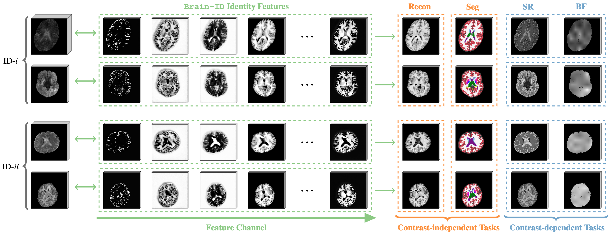
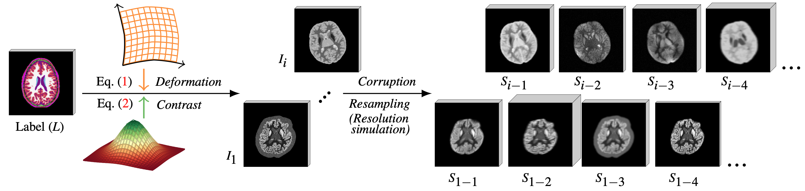

# [Brain-ID: Learning Robust Feature Representations for Brain Imaging]()


<p align="center">
  
</p>


## Environment
Training and evaluation environment: Python 3.11.4, PyTorch 2.0.1, CUDA 12.2. Run the following command to install required packages.
```
pip install -r requirements.txt
```

## Demo: Playing with Brain-ID Sythetic Generator
<p align="center">
  
</p>

```
python scripts/demo_synth.py # config file in BrainID/cfgs/demo_synth.yaml
```


## Training on Synthetic Data
Use the following code to train a feature representation model on synthetic data: 
```
python scripts/train.py anat.yaml
```
We also support Slurm submission:
```
sbatch scripts/train.sh
```

## Evaluating on Real Data
Use the following code to fine-tune a task-specific model on real data, using pre-trained Brain-ID weights: 
```
python scripts/eval.py task_recon.yaml # for reconstruction
# python scripts/eval.py task_seg.yaml # for segmentation
# python scripts/eval.py task_sr.yaml # for super-resolution
# python scripts/eval.py task_bf.yaml # for bias field estimation
```
We also support Slurm submission:
```
sbatch scripts/eval.sh
```

## Download 
Brain-ID pre-trained model: [Google Drive](https://drive.google.com/file/d/1Hoy243gQIWrlIuYULtd2eryk4os-cLLZ/view?usp=sharing)

ADNI, ADNI3 and AIBL datasets: Request data from [official website](https://adni.loni.usc.edu/data-samples/access-data/).

ADHD200 dataset: Request data from [official website](https://fcon_1000.projects.nitrc.org/indi/adhd200/).

HCP dataset: Request data from [official website](https://www.humanconnectome.org/study/hcp-young-adult/data-releases).

OASIS3 dataset Request data from [official website](https://www.oasis-brains.org/#data).

To train Brain-ID from synthetic data, one needs the segmentation labels and their corresponding MP-RAGE anatomy images. We provide our processed segmentation labels for synthetic data simulation [here](). The file names correspond to subject names in [ADNI](https://adni.loni.usc.edu/) dataset. The ground truth T1-weighted, MP-RAGE images need to be requested and downloaded from ADNI's official website as listed above.


## Datasets
After downloading the datasets needed, structure the data as follows:
```
/path/to/dataset/
  modality_name/
    subject_name.nii
    ...
  segmentation_maps/
    subject_name.nii
    ...
```

## Citation
```bibtex
@InProceedings{Liu_2023_BrainID,
    author    = {Liu, Peirong and Puonti, Oula and Hu, Xiaoling and Alexander, Daniel C. and Iglesias, Juan E.},
    title     = {Brain-ID: Learning Robust Feature Representations for Brain Imaging},
    journal   = {arXiv},
    year      = {2023},
    volume    = {abs/},
}